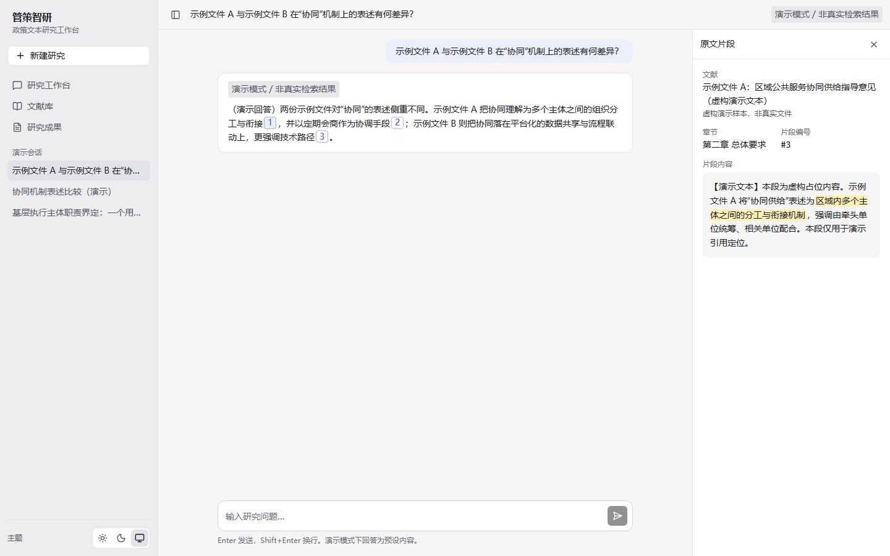

# 管策智研

面向人文社科研究者的政策文本研究工作台。目标是让研究者围绕政策文本提问，并得到可以追溯到原文章节与片段的回答。

## 当前进度

前端基座已完成：设计系统、三栏布局（左侧导航与会话列表、中央研究工作区、按需展开的资料面板）、从回答引用到原文片段的溯源交互，以及单元测试、浏览器测试与 CI。

后端尚未开始，排在路线图第 2 步。在此之前，界面使用内置的虚构数据运行，并标注“演示模式 / 非真实检索结果”。会话暂存在内存中，刷新后丢失；文献库与研究成果页面尚未实现。



## 路线图

以下均未实现，顺序与方案会随进展调整。

1. 前端打磨：多段回答与格式文本渲染、界面细节
2. 对话：新建后端，默认接入 DeepSeek，实现多轮对话、流式输出与停止生成；后端放在哪、用什么技术栈，届时写 ADR 决定
3. RAG：文献上传与解析，按章、条、款切块，语义与关键词混合检索，回答附原文引用
4. 重排：对检索结果重新排序（rerank），比较 Jev（TypeSafe）与专用重排模型
5. 研究 Agent：多步检索、跨文献比较、研究成果沉淀

## 本地开发

要求 Node 24（见 `.node-version`）与 pnpm 10.34.5（`package.json` 中 `packageManager` 已固定，可用 `corepack enable` 自动匹配）。

```bash
pnpm install
pnpm exec playwright install chromium   # 首次运行浏览器测试前执行一次；Linux 加 --with-deps
pnpm dev                                # http://localhost:5173
```

| 命令                | 说明                                                               |
| ------------------- | ------------------------------------------------------------------ |
| `pnpm dev`          | 开发服务器                                                         |
| `pnpm build`        | 类型检查 + 生产构建                                                |
| `pnpm preview`      | 预览构建产物（默认 4173 端口，与浏览器测试相同，二者不能同时运行） |
| `pnpm typecheck`    | `tsc -b`                                                           |
| `pnpm lint`         | oxlint                                                             |
| `pnpm format:check` | Prettier 检查（`pnpm format` 自动修复）                            |
| `pnpm test`         | Vitest，非 watch                                                   |
| `pnpm test:e2e`     | Playwright（自动启动开发服务器于 4173 端口，端口被占用时直接报错） |
| `pnpm check`        | 依次执行格式、Lint、类型、单元测试、构建、浏览器测试               |

CI（`.github/workflows/ci.yml`）在 PR 与主分支 push 时执行同样的 `pnpm check`，失败时上传 Playwright 报告与追踪文件。

## 目录

```
src/
  app/             路由、布局壳、侧栏、主题
  components/ui/   shadcn/ui 风格基础组件（清单见 DESIGN.md）
  features/        业务界面：workspace（工作台）、library / outputs（尚未实现）
  services/        界面唯一的数据访问入口
  mocks/           接入后端前的虚构数据与模拟请求
  styles/          设计 tokens 与全局样式
  types/           界面共享类型
  lib/             与业务无关的小工具
  test/            Vitest 全局设置
tests/e2e/         Playwright 浏览器测试
docs/adr/          架构决策记录
docs/screenshots/  README 中的界面截图（界面明显变化时手动更新）
.github/           CI 与 PR 模板
```

## 参与开发

先读 `AGENTS.md`（开发规则与底线）。改界面前读 `DESIGN.md`，领域术语见 `CONTEXT.md`，开发流程见 `docs/DEVELOPMENT.md`，已定的技术决策见 `docs/adr/`。
